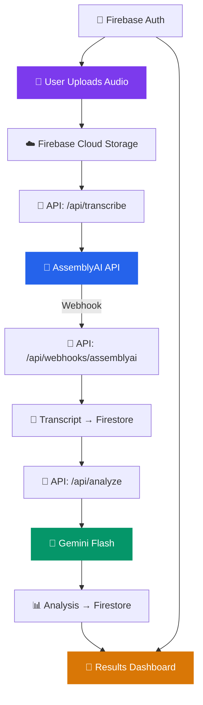

# ClarityAI — AI-Powered Interview Analysis Platform

## Confirmed Decisions

| Decision | Choice | Rationale |
|:---|:---|:---|
| **App Name** | ClarityAI | Clean, professional, instantly descriptive |
| **App Type** | Web app (upload-based) | Extension deferred to Phase 2 |
| **Processing** | Post-processing pipeline | Upload → transcribe → analyze → results |
| **AI Provider** | Gemini Flash (via Firebase AI Logic) | Free tier: 15 RPM, ~1M tokens/day — $0 for MVP |
| **Transcription** | AssemblyAI | 100 hours free, cheapest diarization ($0.02/hr), built-in filler word detection |
| **Styling** | Tailwind CSS v4 + shadcn/ui | Fastest to production-quality UI, industry standard |
| **Auth + DB + Storage** | Firebase (new project) | Auth + Firestore + Cloud Storage in one SDK |
| **Framework** | Next.js 15 (App Router) + TypeScript | Full-stack, server components, API routes |
| **Deployment** | Vercel | Zero-config for Next.js, free tier |

---

## Architecture Overview



### Data Pipeline (How It Works)

1. **Upload**: User uploads audio file (MP3, WAV, M4A, WebM) or records directly in-browser
2. **Store**: File is uploaded to Firebase Cloud Storage with progress tracking
3. **Transcribe**: Server sends the audio URL to AssemblyAI, which transcribes with speaker diarization
4. **Webhook**: AssemblyAI calls our webhook when done (async, takes 1-5 min depending on length)
5. **Analyze**: Server sends transcript to Gemini with a crafted prompt for structured JSON output
6. **Display**: Analysis results are saved to Firestore and rendered on the results dashboard

---

## Proposed Changes

### Complete Folder Structure

```
clarityai/
├── public/
│   ├── favicon.ico
│   └── images/
│       └── logo.svg
│
├── src/
│   ├── app/                          # Next.js App Router pages
│   │   ├── layout.tsx                # Root layout (fonts, providers, nav)
│   │   ├── page.tsx                  # Landing page (hero + features + CTA)
│   │   ├── globals.css               # Tailwind base + custom design tokens
│   │   │
│   │   ├── (auth)/                   # Auth route group (no URL prefix)
│   │   │   ├── login/
│   │   │   │   └── page.tsx
│   │   │   └── signup/
│   │   │       └── page.tsx
│   │   │
│   │   ├── dashboard/                # Protected: user's main hub
│   │   │   ├── layout.tsx            # Dashboard shell (sidebar + header)
│   │   │   └── page.tsx              # Interview list + quick stats
│   │   │
│   │   ├── interview/
│   │   │   ├── new/
│   │   │   │   └── page.tsx          # Upload or record an interview
│   │   │   └── [id]/
│   │   │       ├── page.tsx          # Interview detail (status + transcript)
│   │   │       └── results/
│   │   │           └── page.tsx      # Full analysis results
│   │   │
│   │   ├── history/
│   │   │   └── page.tsx              # All past interviews with filters
│   │   │
│   │   ├── settings/
│   │   │   └── page.tsx              # Profile & preferences
│   │   │
│   │   └── api/                      # Backend API routes
│   │       ├── transcribe/
│   │       │   └── route.ts          # POST: send audio to AssemblyAI
│   │       ├── analyze/
│   │       │   └── route.ts          # POST: send transcript to Gemini
│   │       ├── interviews/
│   │       │   ├── route.ts          # GET/POST: list & create interviews
│   │       │   └── [id]/
│   │       │       └── route.ts      # GET/PATCH/DELETE single interview
│   │       └── webhooks/
│   │           └── assemblyai/
│   │               └── route.ts      # POST: AssemblyAI callback
│   │
│   ├── components/                   # Reusable UI components
│   │   ├── ui/                       # shadcn/ui primitives (auto-generated)
│   │   │   ├── button.tsx
│   │   │   ├── card.tsx
│   │   │   ├── badge.tsx
│   │   │   ├── dialog.tsx
│   │   │   ├── input.tsx
│   │   │   ├── progress.tsx
│   │   │   ├── select.tsx
│   │   │   ├── skeleton.tsx
│   │   │   ├── tabs.tsx
│   │   │   └── toast.tsx
│   │   │
│   │   ├── layout/                   # App shell components
│   │   │   ├── Navbar.tsx
│   │   │   ├── Sidebar.tsx
│   │   │   ├── Footer.tsx
│   │   │   └── ProtectedRoute.tsx    # Auth guard
│   │   │
│   │   ├── interview/                # Interview-specific
│   │   │   ├── AudioRecorder.tsx     # In-browser mic recording
│   │   │   ├── FileUploader.tsx      # Drag-and-drop upload
│   │   │   ├── TranscriptViewer.tsx  # Speaker-labeled transcript
│   │   │   ├── InterviewCard.tsx     # Interview list item
│   │   │   └── StatusTracker.tsx     # Pipeline progress steps
│   │   │
│   │   └── results/                  # Analysis display
│   │       ├── OverallScore.tsx      # Animated circular score gauge
│   │       ├── CategoryCard.tsx      # Score card per category
│   │       ├── StrengthsList.tsx     # What went well
│   │       ├── WeaknessesList.tsx    # Areas to improve
│   │       ├── QuestionBreakdown.tsx # Per-question deep dive
│   │       ├── VocabAnalysis.tsx     # Vocabulary insights
│   │       └── FillerWordChart.tsx   # Filler word bar chart
│   │
│   ├── lib/                          # Shared utilities & services
│   │   ├── firebase/
│   │   │   ├── config.ts             # Firebase client initialization
│   │   │   ├── admin.ts              # Firebase Admin SDK (server-only)
│   │   │   ├── auth.ts               # Auth helpers
│   │   │   ├── firestore.ts          # Firestore CRUD operations
│   │   │   └── storage.ts            # Cloud Storage helpers
│   │   │
│   │   ├── services/
│   │   │   ├── assemblyai.ts         # AssemblyAI API client
│   │   │   ├── gemini.ts             # Gemini analysis service
│   │   │   └── analysis.ts           # Orchestration (transcribe → analyze)
│   │   │
│   │   ├── prompts/
│   │   │   ├── interview-analysis.ts # Main analysis prompt
│   │   │   └── scoring-rubric.ts     # Scoring criteria
│   │   │
│   │   └── utils/
│   │       ├── audio.ts              # Audio file validation
│   │       ├── formatting.ts         # Date/number formatting
│   │       └── constants.ts          # App constants
│   │
│   ├── hooks/                        # Custom React hooks
│   │   ├── useAuth.ts
│   │   ├── useInterview.ts
│   │   ├── useInterviews.ts
│   │   ├── useAudioRecorder.ts
│   │   └── useAnalysis.ts
│   │
│   ├── contexts/
│   │   └── AuthContext.tsx
│   │
│   └── types/                        # TypeScript definitions
│       ├── interview.ts
│       ├── analysis.ts
│       ├── transcript.ts
│       └── user.ts
│
├── firebase/
│   ├── firestore.rules
│   └── storage.rules
│
├── .env.local                        # Secrets (NEVER commit)
├── .env.example                      # Template for env vars
├── .gitignore
├── components.json                   # shadcn/ui config
├── tailwind.config.ts                # Tailwind configuration
├── next.config.ts
├── tsconfig.json
├── package.json
└── README.md
```

> [!NOTE]
> **Key structural decisions:**
> - `components/ui/` is where shadcn/ui components live — you install them one at a time with `npx shadcn@latest add button`, and they become YOUR code (not a dependency). You own and customize them.
> - `lib/services/` abstracts external APIs behind clean interfaces. If you ever swap AssemblyAI for Deepgram, you only change ONE file.
> - `lib/prompts/` gets its own directory because prompt engineering is iterative — you'll tweak these 50+ times.

---

## Firestore Schema

### Collection: `users/{userId}`

```typescript
interface User {
  // Identity (from Firebase Auth)
  email: string;
  displayName: string;
  photoURL: string | null;

  // App-specific
  plan: 'free' | 'pro';
  interviewCount: number;           // Denormalized — avoids counting all docs
  totalMinutesUsed: number;         // Track usage for free tier limits

  // Preferences
  preferredRole: string | null;     // e.g., "Software Engineer"
  experienceLevel: 'student' | 'entry' | 'mid' | 'senior';

  // Timestamps
  createdAt: Timestamp;
  updatedAt: Timestamp;
  lastLoginAt: Timestamp;
}
```

> [!TIP]
> **Denormalization** = storing computed values (like `interviewCount`) directly on the user doc to avoid expensive aggregation queries. In NoSQL, you optimize for reads because reads happen 100x more than writes.

---

### Collection: `interviews/{interviewId}`

```typescript
interface Interview {
  // Ownership
  userId: string;

  // Metadata
  title: string;
  company: string | null;
  role: string | null;
  interviewType:
    | 'behavioral'
    | 'technical'
    | 'system_design'
    | 'hr_screening'
    | 'case_study'
    | 'other';

  // Status (drives the entire UI state machine)
  status:
    | 'uploading'       // Audio being uploaded
    | 'uploaded'        // In storage, ready to process
    | 'transcribing'    // AssemblyAI working
    | 'transcribed'     // Transcript ready
    | 'analyzing'       // Gemini working
    | 'completed'       // Full results available
    | 'failed';         // Error occurred
  errorMessage: string | null;

  // Audio file
  recordingPath: string;            // Cloud Storage path
  recordingDuration: number;        // Seconds
  recordingSize: number;            // Bytes
  mimeType: string;                 // 'audio/webm', 'audio/mp4', etc.

  // External references
  assemblyaiTranscriptId: string | null;

  // Timestamps
  createdAt: Timestamp;
  updatedAt: Timestamp;
  completedAt: Timestamp | null;
}
```

> [!NOTE]
> **The `status` field is a state machine.** Your UI renders completely different views based on this:
> - `uploading` → progress bar
> - `transcribing` → "Transcribing your interview..." with loader
> - `analyzing` → "AI is analyzing your responses..."
> - `completed` → full results dashboard
> - `failed` → error message + retry button

---

### Subcollection: `interviews/{interviewId}/transcript/data`

```typescript
interface Transcript {
  fullText: string;
  segments: TranscriptSegment[];
  wordCount: number;
  speakerCount: number;
  confidence: number;               // Average (0-1)
  processingTime: number;           // Seconds
  createdAt: Timestamp;
}

interface TranscriptSegment {
  speaker: string;                  // 'A', 'B' — mapped to roles
  text: string;
  startMs: number;
  endMs: number;
  confidence: number;
  words: TranscriptWord[];
}

interface TranscriptWord {
  text: string;
  startMs: number;
  endMs: number;
  confidence: number;
  speaker: string;
}
```

> [!TIP]
> **Why word-level data?** This is how we detect stuttering and filler words. Word timestamps let us calculate speaking pace, find the longest pauses, and show users exactly *where* in the interview they struggled.

---

### Subcollection: `interviews/{interviewId}/analysis/results`

```typescript
interface Analysis {
  // Top-level
  overallScore: number;             // 0-100
  summary: string;                  // 2-3 sentence overview

  // Category scores
  categories: {
    communication: CommunicationScore;
    vocabulary: VocabularyScore;
    relevance: RelevanceScore;
    confidence: ConfidenceScore;
    structure: StructureScore;
  };

  // Actionable insights
  strengths: Insight[];
  weaknesses: Insight[];
  suggestions: Suggestion[];

  // Per-question breakdown (most valuable feature)
  questionBreakdown: QuestionAnalysis[];

  // Speech patterns
  speechMetrics: SpeechMetrics;

  // Meta
  modelUsed: string;
  promptVersion: string;
  generatedAt: Timestamp;
}

interface CommunicationScore {
  score: number;
  feedback: string;
  clarity: number;
  conciseness: number;
  articulation: number;
}

interface VocabularyScore {
  score: number;
  feedback: string;
  sophisticationLevel: 'basic' | 'intermediate' | 'advanced' | 'expert';
  industryTermsUsed: string[];
  suggestedTerms: string[];
  overusedWords: { word: string; count: number }[];
}

interface RelevanceScore {
  score: number;
  feedback: string;
  questionResponseAlignment: number;
  tangentCount: number;
}

interface ConfidenceScore {
  score: number;
  feedback: string;
  assertivenessLevel: 'low' | 'moderate' | 'high';
  hedgingPhrases: string[];         // "I think maybe...", "sort of..."
}

interface StructureScore {
  score: number;
  feedback: string;
  usedSTAR: boolean;
  usedFramework: string | null;
  structuredResponses: number;
  unstructuredResponses: number;
}

interface Insight {
  title: string;
  description: string;
  evidence: string;                 // Direct quote from transcript
  impact: 'high' | 'medium' | 'low';
}

interface Suggestion {
  title: string;
  description: string;
  category: string;
  priority: 'critical' | 'important' | 'nice-to-have';
  example: string;                  // "Instead of X, try saying Y"
}

interface QuestionAnalysis {
  question: string;
  response: string;
  score: number;
  feedback: string;
  improvedResponse: string;         // AI-rewritten better answer
  timeSpent: number;
  relevanceScore: number;
}

interface SpeechMetrics {
  totalSpeakingTime: number;
  averagePace: number;              // Words per minute
  fillerWords: { word: string; count: number }[];
  totalFillerCount: number;
  longestPause: number;
  averagePauseDuration: number;
  stutterInstances: number;
  speakingRatio: number;            // % of time interviewee spoke
}
```

> [!IMPORTANT]
> **This schema IS the contract between your AI and your UI.** When we send the transcript to Gemini, we use structured output to force it to return JSON matching these interfaces exactly. Your frontend components are built to render this data directly.

---

## Security Rules

### Firestore Rules
```
rules_version = '2';
service cloud.firestore {
  match /databases/{database}/documents {

    match /users/{userId} {
      allow read, write: if request.auth != null && request.auth.uid == userId;
    }

    match /interviews/{interviewId} {
      allow read, update, delete: if request.auth != null
        && resource.data.userId == request.auth.uid;
      allow create: if request.auth != null
        && request.resource.data.userId == request.auth.uid;

      // Transcript & Analysis: read-only for users, written by server (Admin SDK)
      match /transcript/{docId} {
        allow read: if request.auth != null
          && get(/databases/$(database)/documents/interviews/$(interviewId)).data.userId == request.auth.uid;
        allow write: if false;
      }

      match /analysis/{docId} {
        allow read: if request.auth != null
          && get(/databases/$(database)/documents/interviews/$(interviewId)).data.userId == request.auth.uid;
        allow write: if false;
      }
    }
  }
}
```

### Storage Rules
```
rules_version = '2';
service firebase.storage {
  match /b/{bucket}/o {
    match /interviews/{userId}/{allPaths=**} {
      allow read: if request.auth != null && request.auth.uid == userId;
      allow write: if request.auth != null && request.auth.uid == userId
        && request.resource.size < 500 * 1024 * 1024  // 500MB max
        && request.resource.contentType.matches('audio/.*');  // Audio files only
    }
  }
}
```

> [!NOTE]
> **`allow write: if false` on transcript/analysis** means only the server (Firebase Admin SDK) can write these documents — no client can tamper with scores.

---

## Environment Variables

```bash
# .env.example — Copy to .env.local and fill in values

# Firebase Client (safe to expose — protected by security rules)
NEXT_PUBLIC_FIREBASE_API_KEY=
NEXT_PUBLIC_FIREBASE_AUTH_DOMAIN=
NEXT_PUBLIC_FIREBASE_PROJECT_ID=
NEXT_PUBLIC_FIREBASE_STORAGE_BUCKET=
NEXT_PUBLIC_FIREBASE_MESSAGING_SENDER_ID=
NEXT_PUBLIC_FIREBASE_APP_ID=

# Firebase Admin (server-only — NEVER expose to client)
FIREBASE_ADMIN_PROJECT_ID=
FIREBASE_ADMIN_CLIENT_EMAIL=
FIREBASE_ADMIN_PRIVATE_KEY=

# AssemblyAI (server-only)
ASSEMBLYAI_API_KEY=

# App
NEXT_PUBLIC_APP_URL=http://localhost:3000
ASSEMBLYAI_WEBHOOK_SECRET=
```

---

## Step-by-Step Development Workflow

### Phase 1: Foundation (Week 1-2)
> Set up project, auth, and basic dashboard

| # | Task | Learn |
|:--|:---|:---|
| 1.1 | Create Next.js project + TypeScript | Scaffolding, tsconfig |
| 1.2 | Install & configure Tailwind CSS v4 + shadcn/ui | Utility CSS, component library |
| 1.3 | Create Firebase project + install SDKs | Firebase Console, SDK init |
| 1.4 | Build design system (color palette, typography, dark mode) | Design tokens, CSS variables |
| 1.5 | Implement Firebase Auth (signup/login/logout) | Auth flows, Context API, protected routes |
| 1.6 | Build Dashboard layout (sidebar + header) | Flexbox/Grid, responsive design |
| 1.7 | Create empty dashboard with placeholder cards | Next.js pages, component composition |

---

### Phase 2: Upload & Record (Week 3-4)
> Users can upload or record interviews

| # | Task | Learn |
|:--|:---|:---|
| 2.1 | "New Interview" form (title, company, role, type) | Form handling, validation |
| 2.2 | Audio Recorder component (MediaRecorder API) | Browser APIs, audio streams |
| 2.3 | Drag-and-drop file uploader | File API, drag events |
| 2.4 | Upload to Firebase Cloud Storage with progress | Storage SDK, progress callbacks |
| 2.5 | Create interview document in Firestore | Firestore writes, auto-IDs |
| 2.6 | Interview list on dashboard | Firestore queries, real-time listeners |

---

### Phase 3: Transcription Pipeline (Week 5-6)
> Audio gets auto-transcribed with speaker separation

| # | Task | Learn |
|:--|:---|:---|
| 3.1 | AssemblyAI service module | REST APIs, API clients |
| 3.2 | `/api/transcribe` route | Next.js API routes, server logic |
| 3.3 | `/api/webhooks/assemblyai` route | Webhooks, async processing |
| 3.4 | Status tracker UI | State machines, real-time updates |
| 3.5 | Transcript viewer with speaker labels | Complex UI, timestamps |

---

### Phase 4: AI Analysis Engine (Week 7-8)
> Gemini analyzes transcripts and generates scores

| # | Task | Learn |
|:--|:---|:---|
| 4.1 | Prompt engineering for analysis | Prompt design, structured output |
| 4.2 | Scoring rubric definition | Evaluation criteria, weights |
| 4.3 | Gemini service module | LLM APIs, JSON schema |
| 4.4 | `/api/analyze` route | Multi-step orchestration |
| 4.5 | Speech metrics calculation | Text processing, regex |

---

### Phase 5: Results Dashboard (Week 9-10)
> Beautiful, data-rich results that users love

| # | Task | Learn |
|:--|:---|:---|
| 5.1 | Animated score gauge | CSS animations, SVG |
| 5.2 | Category breakdown cards | Component patterns |
| 5.3 | Strengths & weaknesses display | Conditional rendering |
| 5.4 | Per-question analysis accordion | Expandable UI |
| 5.5 | Filler word bar chart | Data visualization |
| 5.6 | "Better answer" suggestions | Side-by-side UI |

---

### Phase 6: Polish & Ship (Week 11-12)
> Production-ready deployment

| # | Task | Learn |
|:--|:---|:---|
| 6.1 | Error boundaries + skeleton loading states | Error handling, Suspense |
| 6.2 | Responsive design pass | Mobile-first, breakpoints |
| 6.3 | Landing page (hero + features + CTA) | Marketing pages, copywriting |
| 6.4 | SEO optimization | Meta tags, Open Graph |
| 6.5 | Deploy to Vercel | CI/CD, env vars, domains |
| 6.6 | End-to-end testing | QA, edge cases |

---

## API Design

| Route | Method | Purpose |
|:---|:---|:---|
| `/api/interviews` | `GET` | List user's interviews (with pagination) |
| `/api/interviews` | `POST` | Create new interview document |
| `/api/interviews/[id]` | `GET` | Get single interview detail |
| `/api/interviews/[id]` | `PATCH` | Update interview metadata |
| `/api/interviews/[id]` | `DELETE` | Delete interview + audio + results |
| `/api/transcribe` | `POST` | Send audio to AssemblyAI for processing |
| `/api/analyze` | `POST` | Send transcript to Gemini for analysis |
| `/api/webhooks/assemblyai` | `POST` | Receive transcription results callback |

---

## Cost Summary

| Service | Free Tier | Your MVP Cost |
|:---|:---|:---|
| **Vercel** | 100GB bandwidth | **$0** |
| **Firebase Auth** | 50K MAU | **$0** |
| **Firestore** | 1GB, 50K reads/day | **$0** |
| **Cloud Storage** | 5GB | **$0** |
| **AssemblyAI** | 100 hours | **$0** |
| **Gemini Flash** | ~1M tokens/day | **$0** |
| **Total MVP Cost** | | **$0** |

---

## Verification Plan

### Automated
- Unit tests for utility functions (filler word detection, score calculation)
- API route tests with mock data
- Component tests for critical UI (score gauge, status tracker)

### Manual
1. Full auth flow: sign up → login → logout → redirect
2. Upload audio → watch status pipeline → verify transcript → verify analysis
3. Record in-browser → same pipeline
4. Results page renders all categories, suggestions, per-question breakdown
5. Responsive: test 375px (mobile), 768px (tablet), 1440px (desktop)
6. Edge cases: empty audio, <10s audio, >30min audio, network disconnect
